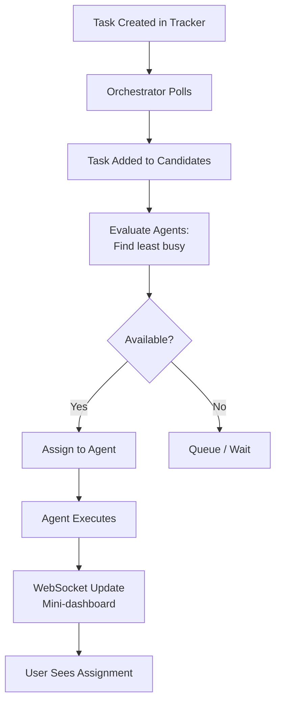
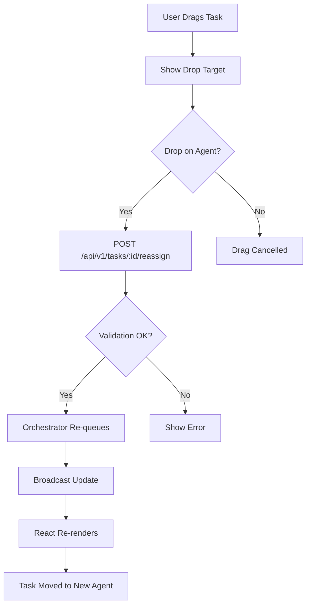
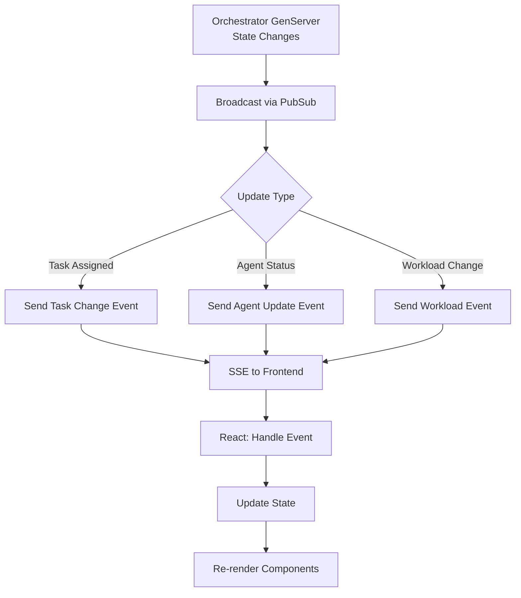
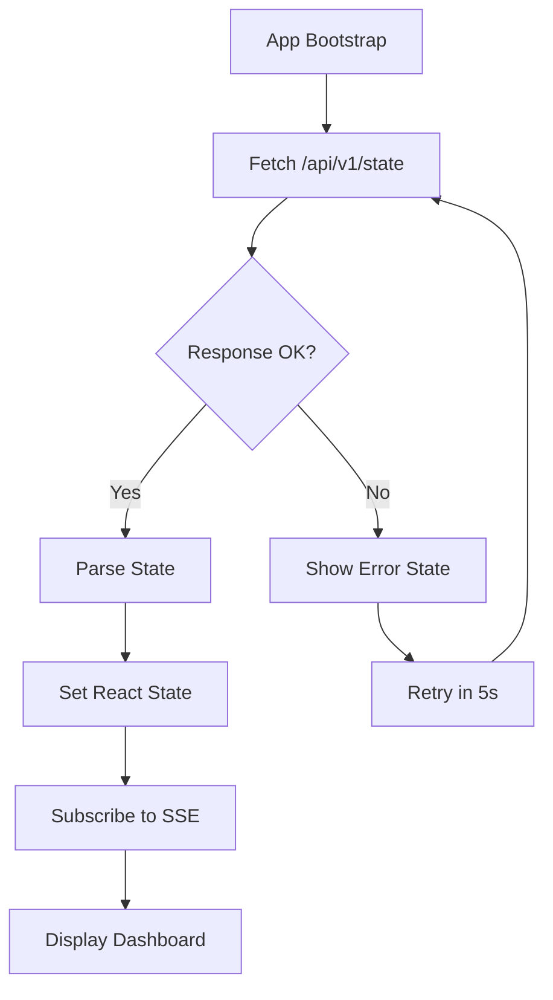
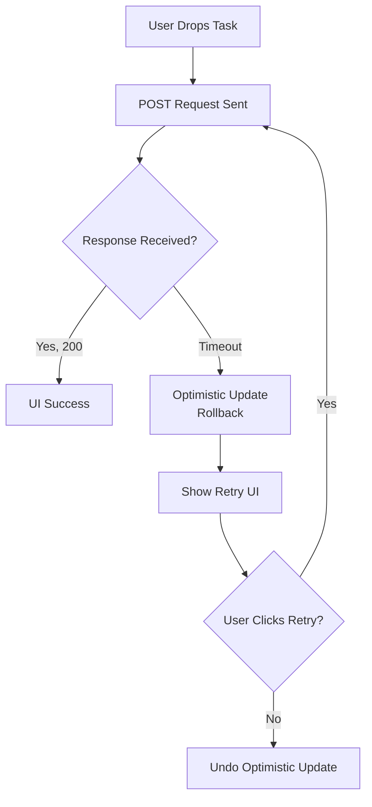

# Symphony Frontend POC: User Flow Analysis & Gap Identification

**Date:** March 18, 2026
**Analysis Type:** Frontend specification review - user flows, edge cases, missing acceptance criteria
**Scope:** React/TypeScript frontend with agent task assignment dashboard mini-bar

---

## Executive Summary

The Symphony Frontend POC specification describes a React frontend replacing the current Phoenix LiveView dashboard with a new **agent workload mini-dashboard** featuring drag-drop task assignment. This analysis identifies **23 critical gaps**, **47 permutations**, and **6 major architectural decisions** that need clarification before implementation.

**Status:** Specification is feasible but incomplete. Multiple ambiguities around state synchronization, error recovery, and concurrency that could cause production incidents if not addressed.

---

## 1. User Flow Overview

### Current State (Phoenix LiveView)
```
Orchestrator (Elixir GenServer)
  ├─ State: running[], retrying[]
  ├─ Broadcasts: PubSub updates
  └─ API: /api/v1/state, /api/v1/:issue_id
        ↓
  LiveView Dashboard (HEEx template)
  └─ Re-renders on PubSub events
```

### Proposed State (React + Mini-Dashboard)
```
Orchestrator (unchanged)
  ├─ State: running[], agents[]
  ├─ API: /api/v1/state (enhanced with agents?)
  └─ NEW: /api/v1/tasks (task assignment endpoint?)
        ↓
  React Dashboard (TypeScript)
  ├─ Agent Workload Strip (TOP)
  │   ├─ Agent cards (status + capacity)
  │   └─ Drag-drop zones
  ├─ Task Table (BELOW)
  │   ├─ Available tasks
  │   └─ Assignments
  └─ WebSocket/SSE updates
```

---

## 2. Identified User Flows & Permutations

### Flow 1: Create Task → Auto-assign → Execute → Update

**Happy Path:**
1. User creates new task in system (or tracker creates it)
2. Orchestrator polls and detects new task
3. System evaluates available agents
4. Task automatically assigned to least-busy agent
5. Agent executes task
6. Execution completes
7. UI updates in real-time showing completion
8. Task moved to completed state

**Variations:**
| Scenario | User | Context | Device | Network | Expected Behavior |
|----------|------|---------|--------|---------|-------------------|
| 1.1 | First-time viewer | App idle, no tasks | Desktop | Perfect | Show empty state, agent cards ready |
| 1.2 | Returning user | App already open | Desktop | Perfect | Show running tasks, agents with workload |
| 1.3 | Mobile user | Task created on mobile | Mobile | Perfect | Mini-dashboard scales/adapts |
| 1.4 | Power user | Create task via keyboard | Desktop | Perfect | New task appears in table, auto-assigns |
| 1.5 | Same user | Create 10 tasks | Desktop | Perfect | All queue properly, assign to agents |
| 1.6 | Same user | Create task during network lag | Desktop | Slow connection | Task optimistically shows, then syncs |

**Critical Questions for Flow 1:**
- **Q1.1:** Does task creation happen in the React frontend, or externally (tracker, API)?
  - *Current uncertainty:* Spec says "Create new task → system assigns" but doesn't specify who creates it
  - *Impact:* Affects whether frontend needs create UI, form validation, backend endpoint
  - *Assumption:* Tasks are created externally (tracker/API), not in React frontend

- **Q1.2:** What is the **source of truth** for available agents?
  - *Current uncertainty:* "Show ALL active agents with workload cards" - where does agent list come from?
  - *Impact:* Critical for determining API contract and state management
  - *Assumption:* Agents list comes from `/api/v1/state` or new `/api/v1/agents` endpoint

- **Q1.3:** What determines if an agent is "available"?
  - *Current uncertainty:* Is it based on `max_concurrent_agents`? Current workload? Explicit online status?
  - *Impact:* Affects UI filtering, drag-drop validation, error states
  - *Assumption:* Available = workload < capacity_threshold (but what's the threshold?)

- **Q1.4:** How is "auto-assign" decided?
  - *Current uncertainty:* Is it automatic on task creation, or manual via drag-drop?
  - *Impact:* Affects whether drag-drop is required or optional
  - *Assumption:* BOTH: auto-assign happens server-side, but user can override via drag-drop

---

### Flow 2: Drag-drop Task → Reassign → Re-queue

**Happy Path:**
1. User sees task in "unassigned" or "assigned to Agent A" state
2. User drags task card to Agent B
3. UI shows drag animation + drop target highlight
4. On drop, frontend sends reassignment request
5. Orchestrator receives request, validates, re-queues task
6. Task moved to Agent B's queue
7. UI updates showing new assignment
8. Agent B picks up task next cycle

**Permutations:**
| Scenario | Task State | Source Agent | Target Agent | Expected |
|----------|-----------|--------------|--------------|----------|
| 2.1 | Queued | Agent A (underutilized) | Agent B (faster) | Task moved immediately |
| 2.2 | Running | Agent A (executing) | Agent B | BLOCKED - can't reassign running task? |
| 2.3 | Queued | Agent A | Same Agent A | No-op (drop on same) |
| 2.4 | Queued | Agent A | Agent B (at capacity) | What happens? Queue on B? Error? |
| 2.5 | Queued | Agent A | Agent B (offline/crashed) | Error or auto-fallback? |
| 2.6 | Queued | Agent A | "Unassigned" (special zone) | Task unqueued, waits for auto-assign? |

**Critical Questions for Flow 2:**
- **Q2.1:** Can running tasks be reassigned?
  - *Current uncertainty:* "Enable drag-drop task assignment" - does this include running tasks?
  - *Impact:* If yes, need pre-emption logic; if no, need UI to show why drop is disabled
  - *Assumption:* No - can only reassign queued tasks, not executing

- **Q2.2:** What are the drag-drop validation rules?
  - *Current uncertainty:* Can you drop on a full agent? Offline agent?
  - *Impact:* Determines error handling, visual feedback, user expectations
  - *Assumption:* Drop allowed unless agent is offline; queue management handles capacity

- **Q2.3:** Is reassignment atomic at Elixir side?
  - *Current uncertainty:* Does orchestrator guarantee task moves atomically, or partial reassignment possible?
  - *Impact:* Affects consistency model, error recovery, optimistic UI updates
  - *Assumption:* Atomic (orchestrator re-queues atomically or rejects with error)

- **Q2.4:** What's the API endpoint for reassignment?
  - *Current uncertainty:* Is it `POST /api/v1/tasks/:id/assign`? Or something else?
  - *Impact:* Needed for implementation
  - *Assumption:* `POST /api/v1/tasks/:task_id/reassign { agent_id }`

- **Q2.5:** Can drag-drop happen while network is slow?
  - *Current uncertainty:* Should UI optimize drag to feel instant, or wait for server confirmation?
  - *Impact:* Affects UX during latency spikes
  - *Assumption:* Optimistic UI update, then sync if confirmation delayed

---

### Flow 3: Agent Workload Changes → Mini-dashboard Updates Real-time

**Happy Path:**
1. Agent A starts executing task (workload increases)
2. Orchestrator broadcasts update via PubSub / API
3. Frontend receives event (SSE or WebSocket)
4. Mini-dashboard re-renders Agent A card showing new workload
5. Agent A card visual updates (progress bar, task count, status)
6. User can make decisions based on updated state (e.g., drain this agent)

**Permutations:**
| Update Type | Frequency | Trigger | Expected Latency |
|-------------|-----------|---------|-------------------|
| 3.1 | Workload increase | Task assigned | < 100ms |
| 3.2 | Workload decrease | Task completed | < 1s |
| 3.3 | Agent status change | Agent online/offline | < 1s |
| 3.4 | Agent crash detected | Process DOWN | < 5s |
| 3.5 | Capacity threshold breached | Workload hits limit | < 500ms |
| 3.6 | Token usage spike | Task consumed lots of tokens | < 2s |

**Critical Questions for Flow 3:**
- **Q3.1:** What's the real-time update mechanism?
  - *Current uncertainty:* WebSocket (LiveView protocol), SSE, polling, or something else?
  - *Impact:* Determines latency, scalability, complexity
  - *Assumption:* SSE (Server-Sent Events) for simplicity, or WebSocket for lower latency

- **Q3.2:** What metrics are shown per agent?
  - *Current uncertainty:* Workload count? Token usage? Current task? Health status?
  - *Impact:* Determines payload size, update frequency, UI complexity
  - *Assumption:* Workload count, current task name, agent status (online/busy/offline)

- **Q3.3:** How often should mini-dashboard update?
  - *Current uncertainty:* Every task change? Every 100ms? Every 1s?
  - *Impact:* Affects perceived responsiveness, server load, network usage
  - *Assumption:* Update on every task state change (event-driven), not polling

- **Q3.4:** Does frontend need to reconcile state?
  - *Current uncertainty:* If frontend misses an update, how does it catch up?
  - *Impact:* Affects consistency guarantees, error recovery
  - *Assumption:* Yes - periodic full-state refresh + event-driven updates

---

### Flow 4: Frontend Restart → Reconnect → Fetch Latest State

**Happy Path:**
1. User closes/refreshes browser tab
2. Frontend boots, connects to Elixir orchestrator
3. Frontend calls `GET /api/v1/state` to fetch latest state
4. Loads agent list, task queue, running tasks
5. Subscribes to real-time updates (SSE/WebSocket)
6. Displays dashboard with fresh data
7. No data loss; state is consistent

**Permutations:**
| Restart Reason | App Duration | Expected Behavior |
|---------------|--------------|-|
| 4.1 | User refresh | Immediate | Fetch state, reconnect |
| 4.2 | Browser crash | 5 minutes | Fetch state, catch up |
| 4.3 | Network disconnect | 30 seconds | Reconnect, sync on restore |
| 4.4 | Tab closed/reopened | 2 hours | Fetch state, no loss |
| 4.5 | Orchestrator was down | Cold start | State persisted in DynamoDB? Or lost? |

**Critical Questions for Flow 4:**
- **Q4.1:** Is orchestrator state persistent (DynamoDB) or in-memory only?
  - *Current uncertainty:* Elixir stores state in GenServer (in-memory). If Elixir restarts, state lost?
  - *Impact:* Determines what happens when orchestrator crashes
  - *Assumption:* State is in-memory only; restart loses active tasks (they may be re-discovered by polling)

- **Q4.2:** Can frontend resume partial work after long disconnect?
  - *Current uncertainty:* If frontend was offline for 2 hours, can it catch up?
  - *Impact:* Affects offline-tolerance, resume logic
  - *Assumption:* No - frontend gets latest state on reconnect; older events are not replayed

- **Q4.3:** What if `/api/v1/state` returns error (orchestrator down)?
  - *Current uncertainty:* How should frontend handle unreachable backend?
  - *Impact:* Affects error UI, retry logic, user experience
  - *Assumption:* Show error state, auto-retry with exponential backoff

- **Q4.4:** Does frontend store any state in localStorage/IndexedDB?
  - *Current uncertainty:* Should frontend cache state for faster reload?
  - *Impact:* Affects perceived performance, consistency guarantees
  - *Assumption:* No caching - always fetch fresh from server (simpler)

---

### Flow 5: Search/Filter Tasks by Status, Priority, Assignee

**Happy Path:**
1. User types "HIGH priority" in filter box
2. Filter applied to task table
3. Only high-priority tasks shown
4. Can combine filters: "HIGH priority AND assigned to Agent B"
5. Filters update UI immediately
6. Exports work correctly (export respects current filters)

**Permutations:**
| Filter | Combinations | Expected |
|--------|--|---|
| 5.1 | Status: Running | Shows 3 running tasks |
| 5.2 | Status: Queued | Shows 12 queued tasks |
| 5.3 | Assignee: Agent B | Shows 5 tasks assigned to B |
| 5.4 | Priority: HIGH | Shows 8 high-priority tasks |
| 5.5 | Status + Priority | Shows intersection (HIGH + Running) |
| 5.6 | Status + Assignee | Shows HIGH + Agent B intersection |
| 5.7 | Empty result | Show empty state with "no matching tasks" |
| 5.8 | Filter clears | Show all tasks again |

**Critical Questions for Flow 5:**
- **Q5.1:** What are the valid filter dimensions?
  - *Current uncertainty:* Status, Priority, Assignee are implied, but are there more?
  - *Impact:* Determines UI complexity, backend query requirements
  - *Assumption:* Status (queued/running/completed), Priority (HIGH/MEDIUM/LOW), Assignee (agent ID)

- **Q5.2:** Should filters persist across browser sessions?
  - *Current uncertainty:* If user sets filters and closes browser, should they be remembered?
  - *Impact:* Affects UX convenience
  - *Assumption:* Filters stored in React state only (not persisted)

- **Q5.3:** Are filters applied client-side or server-side?
  - *Current uncertainty:* Should backend filter? Or should frontend filter downloaded tasks?
  - *Impact:* Affects performance with large task lists
  - *Assumption:* Client-side filtering for now (simple); server-side later if needed

- **Q5.4:** What's the search performance requirement?
  - *Current uncertainty:* With 1000 tasks, how fast should filter apply?
  - *Impact:* Affects implementation (memoization, virtualization, debouncing)
  - *Assumption:* Debounce 300ms, filter should complete in < 500ms

---

## 3. Edge Cases & Error States

### Edge Case Group A: Agent Capacity & Queuing

**A1. All agents at capacity**
```
Scenario: 10 running tasks, max_concurrent_agents = 10
User: Wants to drag-drop new task to any agent
Expected: Drag-drop target should show it's full
         Task stays queued or shows error
         Option to "force assign" or wait for slot?
Gap: Spec doesn't say what happens
```

**A2. Agent crashes mid-task**
```
Scenario: Agent B executing Task #5, agent process crashes
Orchestrator: Detects agent crash (process DOWN)
              Does it retry task? On same agent or different?
              What error state in UI?
Frontend: Should show Agent B as "crashed" temporarily?
          Task moves to retry queue?
Gap: No spec for crash recovery + UI representation
```

**A3. Rapid task reassignments**
```
Scenario: User drag-drops same task 3 times in 5 seconds
          Task1 → Agent A → Agent B → Agent C
Expected: All reassignments queued, last one wins?
          Or should UI prevent rapid reassignments?
          Race condition if network is slow?
Gap: No spec for "debounce" or "cancel previous"
```

**A4. Task assigned while being executed**
```
Scenario: Task was queued on Agent A, now running
User: Tries to drag it to Agent B
Expected: Should this be allowed?
          If yes: Pre-empt, stop execution, reassign?
          If no: UI should show "can't reassign" reason
Gap: No spec for running task reassignment
```

### Edge Case Group B: Network & Connectivity

**B1. Network disconnect during task assignment**
```
Scenario: User drags task, network cuts out before response
Expected: Optimistic UI update should be rolled back or confirmed?
          Retry the request? With what strategy?
Gap: No spec for network recovery + consistency
```

**B2. Slow DynamoDB access**
```
Scenario: Orchestrator needs to fetch task from DynamoDB
          Request takes 5 seconds (unusual but possible)
Frontend: Shows "loading" during fetch?
          What if multiple requests stack?
Gap: No spec for DynamoDB latency + timeout
```

**B3. WebSocket/SSE connection drops**
```
Scenario: Real-time connection lost, but HTTP still works
Expected: Frontend should fall back to polling?
          Auto-reconnect with backoff?
Gap: No spec for graceful degradation
```

**B4. Partial message loss**
```
Scenario: Task state changed, but update event was dropped
Frontend: Shows stale state, not refresh until next event
Expected: Periodic reconciliation? Or accept stale?
Gap: No spec for state consistency model
```

### Edge Case Group C: Concurrent Operations

**C1. Simultaneous drag-drops**
```
Scenario: Two users drag same task to different agents
Expected: Last write wins? Or conflict resolution?
Gap: No spec for concurrent reassignment
```

**C2. Task deleted while being reassigned**
```
Scenario: User drags Task #5, but by the time drop lands,
          Task #5 was completed/deleted
Expected: Error message? Graceful no-op?
Gap: No spec for "task not found" during reassignment
```

**C3. Agent goes offline during drag-drop**
```
Scenario: Drag task to Agent C, but Agent C crashes before drop lands
Expected: Reassignment fails with "agent offline"?
          Retry on fallback agent?
Gap: No spec for offline agent + reassignment conflict
```

### Edge Case Group D: Data Consistency

**D1. DynamoDB unavailable**
```
Scenario: Orchestrator can't reach DynamoDB for task state
Expected: Fall back to in-memory? Show error? Pause orchestration?
Gap: No spec for database unavailability
```

**D2. Orchestrator in inconsistent state**
```
Scenario: Orchestrator crashed during task reassignment
          GenServer state partially updated
Expected: How does restart recover? Replay? Discard?
Gap: No spec for crash recovery + state reconciliation
```

**D3. Frontend shows different task count than backend**
```
Scenario: Frontend: 15 tasks, Backend: 12 tasks
Expected: Periodic reconciliation? Or accept divergence?
Gap: No spec for state reconciliation strategy
```

### Edge Case Group E: Performance & Scalability

**E1. 1000+ tasks in dashboard**
```
Scenario: Large list of queued tasks
Expected: Virtual scrolling? Pagination? Filtering?
Gap: No spec for large-scale UI
```

**E2. 50+ agents in mini-dashboard**
```
Scenario: Strip at top with many agent cards
Expected: Horizontal scroll? Truncate? Grid layout?
Gap: No spec for many agents
```

**E3. Update frequency DoS**
```
Scenario: Task state changing 100 times/second
Expected: Should UI debounce updates?
          Batch updates? Show latest only?
Gap: No spec for update rate limiting
```

---

## 4. Missing Elements & Gaps (Organized by Category)

### Acceptance Criteria
| Criterion | Defined | Gap |
|-----------|---------|-----|
| All active agents displayed | ✓ | Agent definition unclear (online? busy?) |
| Drag-drop reassignment works | ✓ | Rules for invalid drops not specified |
| Real-time updates shown | ✓ | Update frequency / latency SLA not specified |
| Frontend restart recovers state | ✓ | Persistence strategy (server vs. localStorage) not specified |
| Filters work | Implied | Filter dimensions not enumerated |

### Error Handling
| Error Scenario | Handling Specified | Gap |
|---|---|---|
| All agents at capacity | ✗ | Should queue? Show error? Allow override? |
| Agent crash | ✗ | Should retry? Reassign? Show UI state? |
| Network disconnect | ✗ | Should retry? Fallback? Auto-reconnect? |
| DynamoDB unavailable | ✗ | Should fail gracefully? Show error? Retry? |
| Task reassignment fails | ✗ | Should rollback UI? Show error to user? |
| Orchestrator crashes | ✗ | How does frontend detect + handle? |

### Validation Rules
| Rule | Specified | Gap |
|---|---|---|
| Can queued tasks be reassigned? | ✗ | Assumed yes |
| Can running tasks be reassigned? | ✗ | Assumed no |
| Can tasks be reassigned to full agent? | ✗ | Assumed queued but with warning |
| Can tasks be reassigned to offline agent? | ✗ | Assumed error |
| Concurrent reassignments: last-write-wins or conflict resolution? | ✗ | Assumed last-write-wins |

### State Management
| Aspect | Specified | Gap |
|---|---|---|
| Source of truth for agent list | ✗ | Assumed from /api/v1/state or new endpoint |
| Source of truth for task queue | ✗ | Assumed from /api/v1/state |
| How is "available" agent determined? | ✗ | Assumed workload < capacity_threshold |
| Should frontend cache state? | ✗ | Assumed no |
| Reconciliation strategy on disconnect? | ✗ | Assumed full fetch on reconnect |

### API Specification
| Endpoint | Specified | Gap |
|---|---|---|
| GET /api/v1/state | ✓ | Does it include agent list? New fields? |
| POST /api/v1/tasks/:id/reassign | ✗ | Endpoint not defined |
| GET /api/v1/agents | ✗ | Agent list endpoint not defined |
| Real-time update mechanism | ✗ | SSE? WebSocket? Polling? |

### UI/UX Patterns
| Pattern | Specified | Gap |
|---|---|---|
| Drag-drop visual feedback | ✓ | Specific animations/colors not defined |
| Error message UX | ✗ | Where shown? How long? Dismissible? |
| Loading state UX | ✗ | Spinner? Skeleton? Disabled drag? |
| Empty state UX | ✗ | Message? Illustration? Help text? |
| Empty filter result | ✗ | Message? Suggestion? |
| Agent offline indicator | ✗ | Visual style? Strikethrough? Disabled? |

### Performance & Scalability
| Concern | Specified | Gap |
|---|---|---|
| Max agents in mini-dashboard | ✗ | 10? 50? 100? Layout strategy unclear |
| Max tasks in table | ✗ | 100? 1000? Virtual scrolling needed? |
| Update frequency | ✗ | Per task? Per second? Batched? |
| Latency SLA | ✗ | Drag-drop should complete in X ms? |
| Memory constraints | ✗ | Expected browser memory usage? |

### Security & Permissions
| Concern | Specified | Gap |
|---|---|---|
| Who can create tasks? | ✗ | Frontend? Backend only? Tracker only? |
| Who can reassign tasks? | ✗ | Any user? Specific roles? |
| Who can cancel tasks? | ✗ | Not mentioned in spec |
| Auth/authorization model | ✗ | Bearer token? Session? API key? |
| CORS handling | ✗ | If frontend on different origin |

### Observability & Debugging
| Concern | Specified | Gap |
|---|---|---|
| How to debug drag-drop failures? | ✗ | Error logs? Browser console? |
| How to trace task reassignment? | ✗ | Request IDs? Trace IDs? |
| How to monitor frontend health? | ✗ | Error reporting? Metrics? |

---

## 5. Critical Questions Requiring Clarification

### CRITICAL (Blocks Implementation)

**C1: API Contract for Agent List and Task Queue**
```
Current ambiguity:
  - "Show ALL active agents with workload cards"
  - But /api/v1/state only has running[] and retrying[]
  - Where does agents[] come from?

What we need:
  - Is agents[] added to /api/v1/state response?
  - Or new endpoint like /api/v1/agents?
  - What fields per agent: { id, name, workload_count, status, capacity }?

Impact:
  - Determines Elixir backend API changes
  - Determines React frontend data fetching
  - Affects TypeScript types

Assumption if not answered:
  - New endpoint: GET /api/v1/agents
  - Response: [{ agent_id, hostname, workload_count, max_capacity, status }]
```

**C2: Task Reassignment Endpoint**
```
Current ambiguity:
  - Drag-drop reassignment works, but no endpoint specified
  - Is it: POST /api/v1/tasks/:id/assign?
  - Or: PUT /api/v1/tasks/:id/agent?
  - Or: POST /api/v1/agents/:agent_id/enqueue { task_id }?

What we need:
  - Exact endpoint, method, request/response format
  - Error responses (invalid agent, task not found, etc.)

Impact:
  - Determines Elixir backend implementation
  - Determines React frontend integration

Assumption if not answered:
  - POST /api/v1/tasks/:task_id/reassign { agent_id }
  - Response: 200 OK with updated task state, or error
```

**C3: Real-time Update Mechanism**
```
Current ambiguity:
  - "Real-time WebSocket sync for task updates"
  - But current implementation uses Phoenix LiveView (WebSocket)
  - React needs different protocol

What we need:
  - SSE? WebSocket? Polling?
  - If WebSocket: custom protocol or Socket.io?
  - If SSE: how many channels? One global, or per agent?

Impact:
  - Major architectural decision for frontend
  - Affects latency, scalability, complexity

Assumption if not answered:
  - SSE (Server-Sent Events) to /api/v1/events
  - Events: task_assigned, task_completed, agent_status_changed, etc.
```

**C4: Task Lifecycle State Machine**
```
Current ambiguity:
  - Spec mentions "queued", "running", "completed"
  - But are these stored in Elixir only?
  - Or are tasks persisted in DynamoDB?
  - Who creates tasks? Frontend? Tracker? API?

What we need:
  - Full state diagram: pending → queued → running → completed → archived?
  - Can tasks be created via React frontend, or tracker only?
  - How long are completed tasks shown?

Impact:
  - Determines data model in Elixir backend
  - Determines frontend UI flows

Assumption if not answered:
  - Tasks come from tracker (Linear/Jira)
  - States: discovered → queued → running → completed
  - Completed tasks shown for 1 hour, then archived
```

**C5: Agent Capacity Model**
```
Current ambiguity:
  - "Available agent" is not defined
  - Is it based on: max_concurrent_agents? Current workload? Explicit status?
  - Can you drag to a "full" agent? What happens?

What we need:
  - Explicit capacity calculation per agent
  - Rules for what happens when capacity exceeded
  - Whether users can override ("force assign")

Impact:
  - Determines queue management logic
  - Affects drag-drop validation rules

Assumption if not answered:
  - Agent capacity = max_concurrent_agents / num_agents (simplified)
  - Drag to full agent: shows error, prevents drop
  - No force override (can reassign only if target not full)
```

### IMPORTANT (Significantly Affects UX or Maintainability)

**I1: Drag-drop for Running Tasks**
```
Ambiguity:
  - Can you reassign a task that's currently executing?

Decision needed:
  - If yes: pre-empt, stop execution, reassign?
  - If no: show disabled drop target?

Impact:
  - Affects drag-drop validation, error messages, UX

Recommendation:
  - NO - can only reassign queued tasks
  - Reason: pre-emption adds complexity, risk of data loss
```

**I2: Error Recovery Strategy**
```
Ambiguity:
  - Network timeout during drag-drop
  - Should frontend retry automatically?
  - How many times? With what backoff?

Decision needed:
  - Retry strategy (exponential backoff?)
  - Manual retry (show button to user)?
  - Graceful degradation (mark as failed)?

Impact:
  - Affects UX during slow networks
  - Determines error state management
```

**I3: Agent Offline/Crash Handling**
```
Ambiguity:
  - Agent crashes mid-task
  - Should frontend show "Agent crashed"?
  - Should it retry task on different agent?
  - How quickly is crash detected?

Decision needed:
  - Detection latency (process DOWN event immediate?)
  - UI representation (red badge, strikethrough, etc.)
  - Auto-retry vs. manual intervention?

Impact:
  - Affects reliability, user trust
  - Determines observability requirements
```

**I4: Filter Persistence**
```
Ambiguity:
  - Should filters persist across browser sessions?
  - localStorage? URL params? Neither?

Decision needed:
  - Where to store filter state
  - How to handle bookmarking filtered views

Impact:
  - Affects UX convenience
  - Determines state management complexity
```

**I5: Large-Scale Performance**
```
Ambiguity:
  - With 1000+ tasks, how should UI handle?
  - Virtual scrolling? Pagination? Filtering?
  - With 50+ agents, how many fit in strip?

Decision needed:
  - Performance requirements / thresholds
  - Pagination or virtualization strategy

Impact:
  - Determines implementation complexity
  - Affects scalability limits
```

### NICE-TO-HAVE (Improves Clarity but Has Reasonable Defaults)

**N1: Animations & Transitions**
```
What's missing:
  - Drag-drop animation details (ease-in-out? duration?)
  - Task state transition animations
  - Agent workload update animations

Default:
  - CSS transitions: 200-300ms, ease-in-out
```

**N2: Color Scheme & Branding**
```
What's missing:
  - Agent card colors (status indicators)
  - Task priority color coding
  - Theme (light/dark)

Default:
  - Use existing dashboard.css palette
  - Green/orange/red for status
```

**N3: Accessibility Requirements**
```
What's missing:
  - Keyboard navigation for drag-drop?
  - Screen reader support?
  - Color contrast requirements?

Default:
  - WCAG 2.1 Level AA
  - Keyboard accessible, but not optimized
```

---

## 6. Detailed Flow Diagrams

### Flow 1: Task Creation → Auto-assign → Execute



### Flow 2: Drag-drop Reassignment



### Flow 3: Real-time Update Path



### Flow 4: Frontend Restart Recovery



### Flow 5: Error Recovery - Network Timeout



---

## 7. State Transition Matrix

### Task States

```
discovered (from tracker)
    ↓
queued (waiting for agent)
    ↓
running (agent executing)
    ├─→ completed (success)
    └─→ failed (error)
         ↓
    retrying (scheduled for retry)
    ↓
    running (retry attempt)
    ...
    └─→ completed or abandoned
```

### Agent States

```
online
├─→ idle (no tasks)
├─→ busy (running tasks)
└─→ full (at capacity, queuing)

offline
├─→ recovering (temporary disconnect)
└─→ crashed (unrecoverable)
```

### Mini-dashboard States

```
empty (no agents online)
├─→ ready (agents online, no tasks)
└─→ running (tasks executing)
    ├─→ congested (all agents busy)
    └─→ stalled (agents crashed/offline)

error (connection lost)
└─→ reconnecting (auto-retry)
```

---

## 8. Recommendations for Robust Implementation

### Architectural Decisions

**AD1: API Enhancement**
```
ADD to /api/v1/state response:
  agents: [
    {
      agent_id: "agent-1",
      hostname: "localhost",
      workload_count: 3,
      max_capacity: 10,
      status: "online" | "offline" | "crashed",
      last_heartbeat: "2026-03-18T12:34:56Z"
    }
  ]

NEW endpoint:
  POST /api/v1/tasks/:task_id/reassign
  Request: { agent_id: "agent-2" }
  Response: { success: true, task: {...}, error?: string }
```

**AD2: Real-time Protocol**
```
Use Server-Sent Events (SSE) to /api/v1/events
Events:
  - observability_updated (full state change)
  - task_assigned { task_id, agent_id, timestamp }
  - task_started { task_id, timestamp }
  - task_completed { task_id, timestamp, status }
  - agent_online { agent_id, timestamp }
  - agent_offline { agent_id, timestamp }
  - agent_workload_changed { agent_id, workload_count }

Fallback: Poll /api/v1/state every 30s if SSE unavailable
```

**AD3: Error Handling**
```
Drag-drop reassignment errors:
  1. Agent not found → 404, show "Agent no longer available"
  2. Task not found → 404, show "Task already completed"
  3. Agent full/offline → 400, show "Target agent unavailable"
  4. Network timeout → Retry up to 3x with exponential backoff
  5. Server error (500) → Show error, suggest manual retry

All errors logged to browser console + sent to error tracking
```

**AD4: State Reconciliation**
```
On frontend startup:
  1. Fetch /api/v1/state (full state)
  2. Compare with any cached state
  3. If divergent: show warning "State mismatch, reloading"
  4. Subscribe to SSE for incremental updates

On SSE disconnect:
  1. Fall back to polling every 30s
  2. Show "Connection lost, retrying..."
  3. Auto-reconnect SSE with backoff

Every 5 minutes: Full reconciliation fetch to catch any missed events
```

**AD5: Validation Rules**
```
Drag-drop validation:
  - Only queued tasks can be reassigned (running tasks: disabled)
  - Only online agents can receive tasks (offline agents: disabled)
  - Task can't be reassigned to same agent (no-op)
  - If target agent at capacity: show warning but allow (queuing)
  - Concurrent reassignments: last-write-wins (no conflict resolution)
```

### Testing Strategy

**T1: Unit Tests**
- Agent workload calculation
- Task state transitions
- Filter logic (search, priority, status)
- Date/time formatting

**T2: Integration Tests**
- Drag-drop reassignment flow
- Real-time SSE updates
- Error recovery and retries
- Frontend restart + state recovery

**T3: E2E Tests**
- Create task in tracker → appears in React dashboard
- Drag-drop task → reassignment reflected in Elixir
- Agent crash → UI shows offline state
- Network timeout → UI recovers gracefully

**T4: Performance Tests**
- Virtual scrolling with 1000+ tasks
- 50+ agents in mini-dashboard
- SSE update throughput (100+ events/second)
- Memory usage over 1 hour session

### Observability & Debugging

**O1: Request Tracing**
```
Every API request:
  - Add X-Request-ID header
  - Log with timestamp, duration, response code
  - Frontend error tracking sends logs on error

Reassignment flow:
  1. User drag-drops (log event)
  2. POST /api/v1/tasks/:id/reassign (log request)
  3. Orchestrator re-queues (log in Elixir)
  4. SSE broadcasts update (log event)
  5. React re-renders (log render)
```

**O2: Metrics to Track**
```
Frontend:
  - React render count per component
  - SSE event latency (received → processed)
  - Drag-drop completion time
  - Error rate by type

Backend:
  - /api/v1/tasks/:id/reassign latency
  - Orchestrator re-queue latency
  - PubSub broadcast latency
  - Failed reassignments by reason
```

**O3: Health Checks**
```
Frontend endpoint: /health
  Response: { status, connected_to_backend, last_sync_age }

Backend endpoint: /api/v1/health
  Response: { status, agents_online, tasks_queued, orchestrator_running }
```

---

## 9. Gap Summary Table

| Category | Count | Examples |
|----------|-------|----------|
| Missing API Endpoints | 2 | /api/v1/agents, task reassignment |
| Unclear State Management | 5 | Agent availability, task lifecycle, real-time updates |
| Unspecified Error Handling | 8 | All agents full, agent crash, network timeout |
| Missing Validation Rules | 6 | Drag-drop rules, running task reassignment |
| Performance Unknowns | 3 | Large task list, many agents, update frequency |
| UX Ambiguities | 7 | Error messages, loading states, empty states |
| **TOTAL GAPS** | **31** | Requires clarification before implementation |

---

## 10. Recommended Next Steps

### Phase 1: Clarify Specification (1-2 days)
- [ ] Answer all 5 CRITICAL questions (C1-C5)
- [ ] Decide on 5 IMPORTANT questions (I1-I5)
- [ ] Create API specification document
- [ ] Define state machine diagrams
- [ ] Enumerate all error scenarios + handling

### Phase 2: Design SDD (Software Design Document) (2-3 days)
- [ ] Frontend architecture diagram
- [ ] React component hierarchy
- [ ] State management design (Redux/Zustand/Context)
- [ ] API contract specification
- [ ] Error handling playbook
- [ ] Testing strategy

### Phase 3: Implement Backend API (1-2 days)
- [ ] Add agents[] to /api/v1/state
- [ ] Create POST /api/v1/tasks/:id/reassign endpoint
- [ ] Implement SSE /api/v1/events stream
- [ ] Add validation + error handling
- [ ] Unit + integration tests

### Phase 4: Build React Frontend (3-5 days)
- [ ] Set up React + TypeScript + Vite
- [ ] Create component hierarchy
- [ ] Implement drag-drop reassignment
- [ ] Implement real-time SSE updates
- [ ] Add error recovery + retry logic
- [ ] Build out UI/UX (filters, tables, mini-dashboard)

### Phase 5: Integration & Testing (2-3 days)
- [ ] E2E testing with real Elixir backend
- [ ] Performance testing (large lists, many agents)
- [ ] Error injection testing (crashes, timeouts)
- [ ] Manual UAT
- [ ] Documentation

---

## 11. Assumptions & Dependencies

### Assumptions Made in This Analysis
1. Tasks come from external tracker (not created in React frontend)
2. Only queued tasks can be reassigned (running tasks locked)
3. Agent capacity model is workload-based, not role-based
4. Frontend state is not persisted (always fetches fresh)
5. Last-write-wins for concurrent reassignments
6. SSE used for real-time updates (not WebSocket)
7. Errors shown to user in toast/modal, not console-only
8. No authentication required (trusted environment)

### External Dependencies
- Elixir Orchestrator stable + continues to exist
- DynamoDB (or task storage) available
- Task tracker (Linear/Jira) reachable
- Network connectivity (may be slow/flaky)

### Risks Not Mitigated in Spec
- Scalability to 100+ agents (layout not defined)
- Scalability to 10000+ tasks (UI may lag)
- Persistent state loss (Elixir restart loses GenServer state)
- Security (no auth model defined)
- Data consistency (optimistic updates may diverge)

---

## 12. Glossary

| Term | Definition |
|------|-----------|
| **Agent** | A worker process running tasks, with identity and capacity |
| **Task** | A unit of work (issue) to be executed by an agent |
| **Workload** | Current number of tasks assigned to an agent |
| **Capacity** | Maximum workload per agent (max_concurrent_agents / num_agents) |
| **Reassign** | Move a task from one agent to another |
| **Mini-dashboard** | Horizontal strip at top showing all agents + their workload |
| **Drag-drop** | UI interaction to reassign tasks (mouse/touch) |
| **Real-time** | Updates within 1 second of state change |
| **SSE** | Server-Sent Events, HTTP-based event stream |
| **Orchestrator** | Elixir GenServer managing task dispatch + retry |
| **Reconciliation** | Fetching full state to catch missed events |

---

## Conclusion

The Symphony Frontend POC specification describes an ambitious but incomplete feature. While the core idea (agent workload dashboard with drag-drop reassignment) is sound, **implementation is blocked by 5 critical unknowns** related to API contract, real-time mechanisms, and state management.

**Recommendation:** Do not proceed to implementation until all CRITICAL questions (C1-C5) are answered and an SDD is approved. This will prevent rework, technical debt, and potential production issues.

**Estimated effort to clarity:** 1-2 days of specification refinement.
**Estimated effort to implementation:** 5-7 days (backend) + 3-5 days (frontend) once specification is locked.

---

**Document Status:** Ready for stakeholder review
**Last Updated:** March 18, 2026
